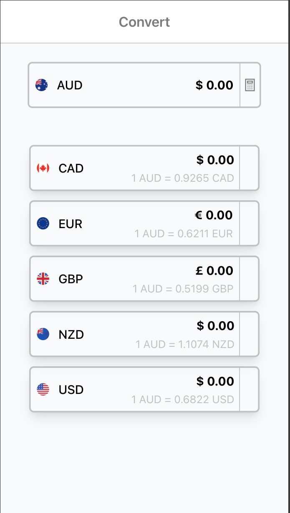
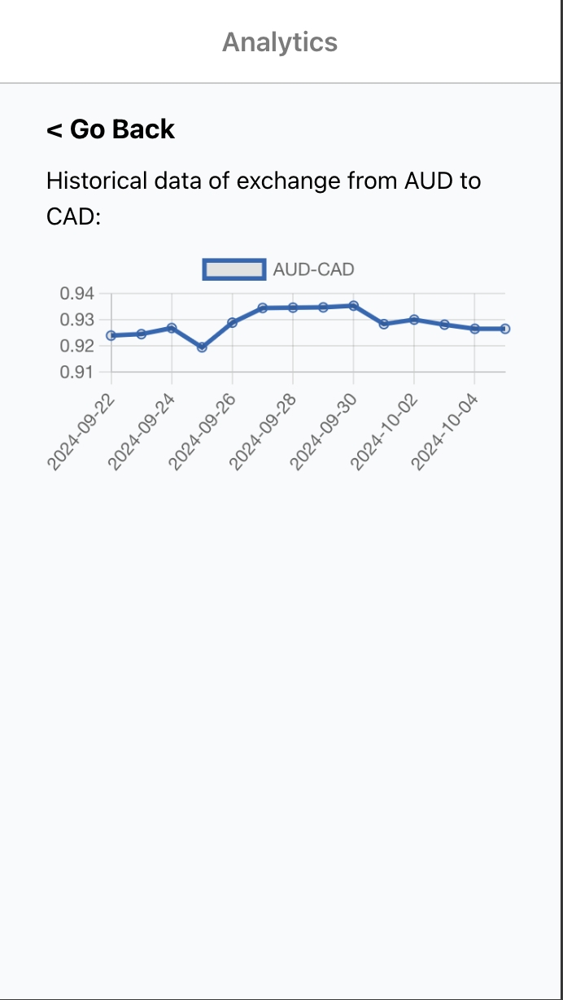
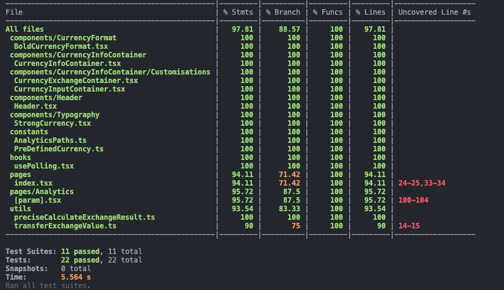

# Creative Factory Code Test

## Brief of Project Outcomes:

Since the main requirement for this app is to calculate real-time exchange rates, data timeliness and accuracy are crucial.



### Real Time Data：

In Fintech-related products, real-time data is undoubtedly a critical standard, as any delay in data could potentially lead to financial losses. In this Code Challenge, the API provided by Openexchangerates does not support **_Websocket_** or **_SSE_** connections. To address the real-time data issue, I implemented a **_polling mechanism_** by encapsulating a custom hook-usePolling, to frequently fetch and update the data.

However, although this approach seems to mitigate the problem of RESTful APIs being unable to push real-time data to the client, it’s not an optimal solution for the following reasons:

1.  SetInterval can be affected by the event loop, leading to inaccurate timing.
2.  Frequent HTTP requests to the server may impose unnecessary overhead on both the client and the server.

For these reasons, if time permits, I would opt to use Websocket as the data-fetching solution, and implement a Websocket endpoint using Node.js for the frontend to retrieve real-time data.

### Data Calculation Accuracy:

Due to binary computation, JavaScript often loses precision when performing calculations with large numbers and float numbers. This issue is unacceptable in financial products. To resolve this, I used the **_Big.js_** library for currency conversion to minimize calculation errors.

### Rendering Strategy:

For this Code Challenge, I used Next.js and chose a hybrid rendering mode combining SSR (Server-Side Rendering) and CSR (Client-Side Rendering) for the exchange rate calculation page. We initiate the first real-time exchange rate data request on the server. After the page is loaded on the client side, polling is started to fetch real-time data. This ensures both real-time data updates and good SEO performance.

On the Analytics page, since only historical data for the past 14 days is needed (and this data is not further subdivided), I opted for ISR (Incremental Static Regeneration). The page is re-rendered every 30 minutes.

### Unit Testing:

A mature commercial front-end project should have sufficient test cases and high test coverage. I applied the same standard in this project. I used Jest and React-Testing-Library for unit testing. Except for particularly complex cases, the tests cover the entire app, with a line coverage of 97.81%:


### Project Management:

Although this is a personal project, I still aimed to standardize the project management process as much as possible. I used Husky for pre-commit hooks, ESLint and Prettier to ensure code quality, and pnpm as the package manager with a pre-install hook using npx pnpm-only to enforce package manager consistency. To ensure the project runs smoothly, please make sure your Node.js version is 20 or above, and your pnpm version is 9.4 or above. I also added an engine lock in package.json to enforce consistency in the runtime environment.

```json
	"engines": {
		"node": ">=20",
		"pnpm": ">=9.4"
	},
	"engineStrict": true
```

## Project Tech Stack

<table align="center" border=0>
   <tr>
      <td width="500"><b>Front-end</b></td>
   </tr>
   <tr>
      <td>
         • Node Version: v20.14<br>
         • Framework: Next.js 14 Page Route (The React version we are using is 18)<br>
         • Scripting Language: Typescript<br>
         • Styling: TailwindCSS<br>
         • ApiClient: Fetch API<br>
         • Testing: Jest, React-testing-library<br>
         • Code Control: Eslint, Prettier<br>
         • Git Hook: Husky，lint-staged<br>
         • Package Manager: pnpm v9.4, node v20.4 <br>
      </td>
   </tr>
</table>

## Getting Started ✨ :sparkles:

**Before start, please make sure you are using pnpm version 9.4 or above and nodejs version 20 or above, otherwise every manipulation will rejected by the engine lock**

### Install dependencies

```bash
$ pnpm install
```

### Start the server

```bash
$ pnpm run dev
```

Open [http://localhost:3000](http://localhost:3000) with your browser to see the result.

You can start editing the page by modifying `src/pages/index.tsx`. The page auto-updates as you edit the file.

### Environment Variables

Add a file named `.env` at the root directory. Ask Repository Owner for the .env file for our application

### Build for Deploy

```shell
$ pnpm run build
```

### Run the Production

```shell
$ pnpm run start
```

### Run All Test

```shell
$ pnpm run test
```

### Run Single Test With Watching And Display Coverage

```shell
$ pnpm run test filename --watch --coverage
```

## Project structure

```
$PROJECT_ROOT
│   # run some command when you commit
├── husky
│   #icon
├── public
│
├── src
│   │   # All unit tests
│   ├── tests
│   │   # All organized API
│   ├── APIs
│   │   # All images
│   ├── assets
│   │   # React component files
│   ├── components
│   │   # All constants
│   ├── constants
│   │   # All types and interfaces
│   ├── types
|   │   # All hooks
│   ├── hooks
│   │   # Page layout
│   ├── layouts
│   │   # Page files
│   ├── pages
│   │   # Styles
│   ├── styles
│   │   # For all further encapsulation of another api and libraries
│   ├── libs
│   │   # All the utilities functions
│   ├── utils
```

<i><b>Enjoy the journey!</b></i>:clap:
